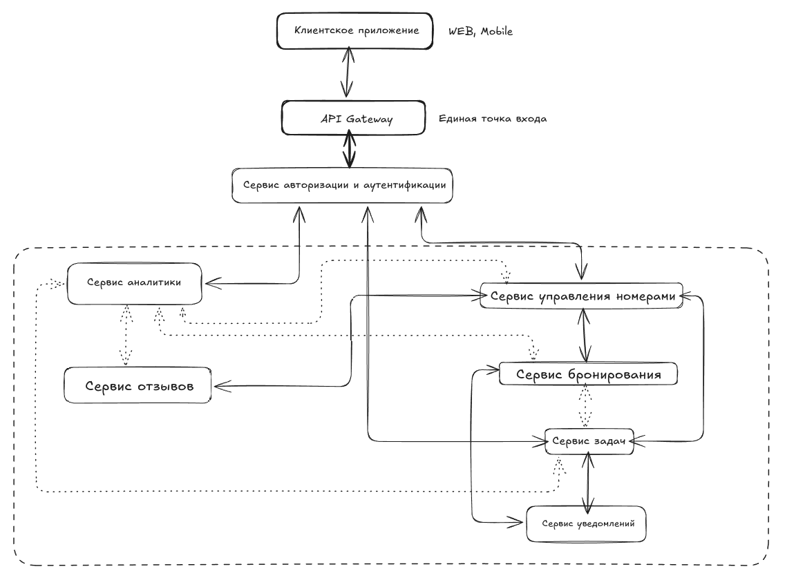

# Задание 2: Интеграции

- Взять ФТ и НФТ из HW_1
- Подумать какие сервисы будут и какие интеграции между ними лучше сделать
- Выбрать способ взаимодействия между сервисами, написать обоснование
- Сделать верхнеуровневую схему HLD: описать клиента, сервисы, интеграции

# Решение 

## ФТ и НФТ из HW_1

### Функциональные требования

Акторы: гости, сотрудники отеля

 

Домены системы: 
- бронирование;
- гостевой сервис;
- операционный менеджмент;
- аналитика;
- поддержка текущей инфраструктуры.

 

Данные:
- пользователей;
- о бронировании;
- состоянии номеров/других помещений отеля;
- операционные.

 

Функции:

Для гостей:

1. Онлайн-выбор номера:

- просмотр фотографий каждого номера;
- просмотр расположения номеров в отеле;
- фильтрация поиска.

Для персонала:

1. Система управления уборкой:

- приоритетные задания;
- просмотр всех заданий;
- просмотр расположения заданий для горничных;
- подтверждение выполнения задания.

2. Учёт информации о номерах отеля:

- сохранение статуса номера;
- информация и даты бронирования номеров.

### Нефункциональные требования

1. Производительность:

- время отклика меньше 2 секунд для 95% запросов;
- поддержка 500 одновременных пользователей.

2. Маштабируемость

- горизонтальное маштабирование (использование балансироващика нагрузки);
- горизонтальный и вертикальный шардинг БД.

3. Отказоустойчивость

- использование балансировщика нагрузки;
- каждая критически важная часть системы должна работать (как минимум) на двух физически распределенных серверах;
- бэкапы транзакций каждые 10 минут, восстановление работы после сбоя должно быть меньше 30 минут.
- резерное копирование.

4. Безопасность

- двухэтапная аутентификация;
- защита от хакерских атак;
- шифрование данных гостей.

5. Мониторинг

- сбор метрик;
- логирование системы;
- своевременность реагирования на проблемы в системе.

6. Регулярные требования

- требования по обработке персональных данных (Федеральный закон "О персональных данных" от 27.07.2006 N 152-ФЗ), например, хранение на серверах на территории РФ, получение согласия на обработку от пользователей, использование СКЗИ;
- интеграция с ЕГИС "МИР" для учета гостей;
- требования к договорам бронирования, турестической деятельности (Федеральный закон "Об основах туристской деятельности в Российской Федерации" от 24.11.1996 N 132-ФЗ).

7. Переносимость и совместимость системы

С текущими сервисами бронирования.

8. Пользовательский опыт

- минимальное количество действий для выполнения функций (например, бронирования или ознакомления со списком задач для уборки);
- предпочтения пользователя в бронирования и рекомендации;
- скорость работы и единство дизайна;
- выполнение функций без багов для бронирования номера, взаимодействия с сервисами гостя или для выполнения трудовых обязательств.

## Подумать какие сервисы будут и какие интеграции между ними лучше сделать

- Сервис авторизации и аутентификации 
- Сервис управления номерами 
- Сервис бронирования
- Сервис задач
- Сервис отзывов
- Сервис уведомлений
- Сервис аналитики

| Интеграции | Тип | Цель |
|:-----------|:---:|-----:|
| Сервис авторизации <=> все остальные сервисы | Синхронная (Rest) |  Проверка аутентификации и авторизации всех запросов|
| Сервис бронирования <=> Сервис управления номерами | Синхронная (gRPC) | Проверка доступности номеров при бронировании и обновление статуса |
| Сервис бронирования <=> Сервис задач | Асинхронная (Kafka) | Создание задач на уборку после выезда гостя |
| Сервис управления номерами <=> Сервис задач | Синхронная (gRPC)| Получение информации об уборке и техническому обслуживанию для персонала |
| Сервис задач <=> Сервис уведомлений | Синхронный (gRPC) | Новая задача создана, тогда мгновенное уведомление о ней, а когда задача выполнена, то уведомление для проверки |
| Сервис бронирования <=> Сервис уведомлений | Синхронный (gRPC) | Получение информации о бронировании |
| Сервис бронирования <=> Сервис отзывов | Синхронный (gRPC) | Возможность оставления отзыва после выезда |
| Все сервисы <=> Сервис аналитики | Асинхронная  (Kafka) | Сбор данных для аналитики |

## Выбрать способ взаимодействия между сервисами, написать обоснование

Синхронное взаимодействие (REST/gRPC) для:
- Запросов, требующих немедленного ответа (например, для проверки доступности номера);
- Операций, где важна согласованность данных
- gRPC для внутренней коммуникации для производительности

Асинхронное взаимодействие (Kafka) будем использовать для:
- Событий, не требующих немедленной обработки (например, уведомление о необходимости уборки)
- Масштабируемости и отказоустойчивости

## Сделать верхнеуровневую схему HLD: описать клиента, сервисы, интеграции

--- - это асинхронное взаимодействие
_ - синхронное взаимодействие

