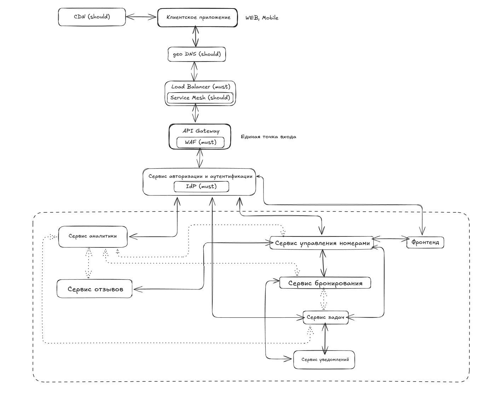

# Задание 4: High Level Design

- Доделать High Level Design, добавив в систему дополнительные компоненты и обосновать их целесообразность.
- Ваша задача понять, какие дополнительные компоненты ОБЯЗАТЕЛЬНЫ (MUST) в вашей системе, а какие МОЖНО (SHOULD) добавить в систему.
- Если знаете, какие конкретно компоненты выбрать (технологии): пишите в реализацию. Если нет, не страшно.
- Добавить их на схему в ваш HLD.

# Решение 

## Обязательные компоненты (MUST)

| Компонент |	Обоснование | 	Реализация (опционально) |
|----------:|:-------------:|:---------------------------|
| Load Balancer |	Распределение трафика между инстансами сервисов. Критично для горизонтального масштабирования и отказоустойчивости | Yandex Application Load Balancer |
| WAF	| Защита от OWASP Top 10 атак, особенно важна для обработки персональных данных и платежной информации |	Cloudflare WAF |
| IdP (Identity Provider) |	Централизованная аутентификация для гостей, персонала и администраторов |	Keycloak |
| Кэш	| Уменьшение нагрузки на БД для часто запрашиваемых данных (номера, доступность, тарифы) |	Redis Cluster |
| CI/CD Pipeline	| Автоматизация развертывания, требование для соблюдения SLA на обновления	| GitLab CI |
| Обзервабилити	 | Комплексный мониторинг для выполнения требований по доступности и производительности	|OpenTelemetry Collector + Prometheus + Loki + Grafana |
| Резервное копирование	 | Гарантия восстановления данных согласно 152-ФЗ и требованиям бизнеса	| WAL-G для PostgreSQL + ежечасные снепшоты в Yandex Object Storage |
| Message Broker |	Обеспечение коммуникации между сервисами | Apache Kafka |
| API Gateway	| Единая точка входа для всех API, безопасность, rate limiting | Kong Gateway  |

## Рекомендуемые компоненты (SHOULD)

| Компонент	| Обоснование	| Реализация (опционально) |
|----------:|:-------------:|:-------------------------|
| Service Mesh	| Упрощение управления трафиком между микросервисами | Istio |
| Disaster Recovery Site	| Резервный дата-центр для обеспечения непрерывности бизнеса	| Вторичный кластер в другом регионе Yandex Cloud |
| CDN	| Доставка статики (фото номеров, документы)  |	Yandex CDN + Object Storage для медиа |
| DWH	| Аналитика и отчетность для бизнес-решений	| ClickHouse |
| Document Management |	Хранение и обработка сканов документов гостей (требование 152-ФЗ) |

## Добавить их на схему в ваш HLD

