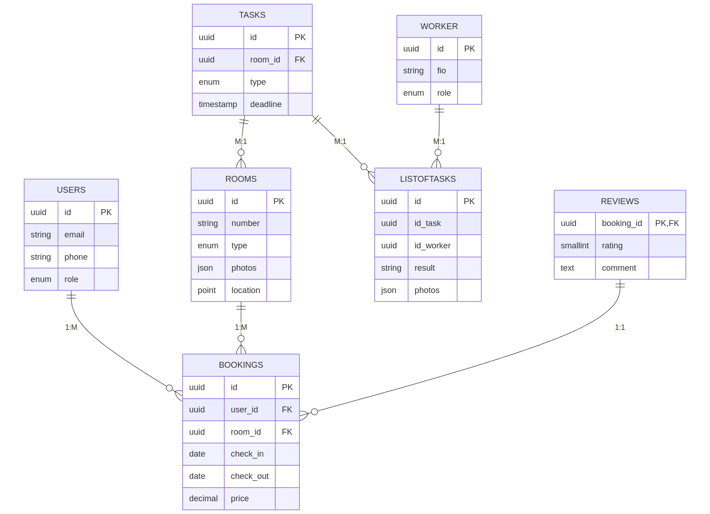
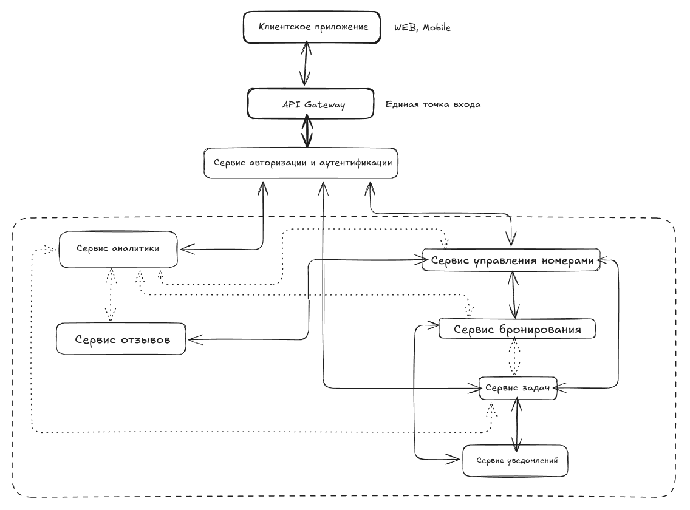
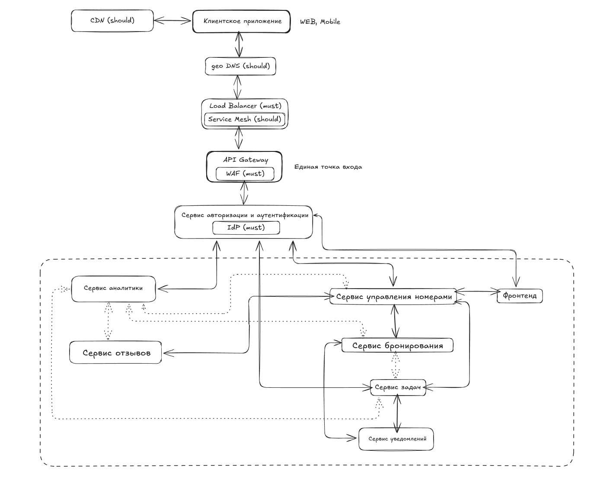

# System Design Document
## Дизайн системы  <i>Room With A View</i>
    
### Глоссарий

| Термин  | Определение |
| ------------- | ------------- |
| System Design  |  Процесс проектирования систем с учетом всех их компонентов и взаимодействий  |
| System Design Interview  | Этап собеседования, на котором оценивается умение проектировать сложные системы  |

### 1. Цели и предпосылки (Отсев + Scope Refinement)

### Отсев

Срыв сроков приведет к отсутствию системы на текущий пиковый сезон, что может привести:
- к финансовым потерям;
- отказу от совместной работы;
- репутационным рискам.

 

Успех можно измерить:
- операционной эффективностью (время, которое было затраченно от появления заявки на уборку до её окончания);
- удовлетворенностью гостей и персонала (например, оставленные отзывы);
- эффективность работы системы бронирования (например, по среднему временю бронирования, количество доведенных бронирований до конца).

 

Стандартные функции бронирования (например, платежи, информация о регистрации и т.д.) реализованы с использованием существующей системы бронирования.

 

Критические для MVP к пиковому сезону:

- выбор конкретного номера, его бронирование;
- интеграция с существующей платежной системой;
- управление статусами номеров;
- интерфейсы для персонала отеля (приложение для горничных, для администрации).

 

Дополнительные этапы:

- интеллектуальные замки;
- продвинутая аналитика для выявления потребности рынка высокого класса и загрузки отеля/спа-салона;
- кастомизация под продавцов.

 

Реалистичность:

- сложность создания системы в кратчайшие сроки, поэтому должна быть концентрация на основных функциях системы, требуется отложить реализацию некритических компонентов системы;
- могут возникнуть сложности при интеграции с существующими системами для стандартных функций бронирования, следует предусмотреть возможные проблемы и заложить дополнительное время для их решения;
- с учётом санкций следует выбирать инструменты, программные продукты, подходящие для нашего рынка (импортозамещенные, аналоги, продукты с открытой лицензией).

#### 1.1. Заполните контрольные вопросы

- Какая цель у стейкхолдеров?

Повысить доходность отеля на N% за счет автоматизации процессов бронирования, уборки и управления ресурсами, сократив операционные расходы на N%

- Какую проблему решает система?

Ручное управление бронированиями ведет к ошибка, например, таким как, потеря бронирования.

Неэффективное распределение задач персоналу, например, задержки уборки, простои.

- Какой результат будем считать успехом?

Увеличение заполняемости номеров на N%.
Сокращение времени обработки бронирования с 30 мин до 10 мин.
Уменьшение жалоб гостей на уборку на 40%.

- Как будем измерять результат?

Метриками для определения заполняемости номеров, определением временем бронирования, отзывами

- Для кого создается система и какие боли закрываем?

Гости: долгое оформление брони, отсутсвие прозрачности статуса.

Персонал: хаотичное распределение задач, дублирование поручений.

- Что если сорвем сроки?

Пиковый сезон пройдет без автоматизации, что приведет к потери прибыли.

- Какие есть зависимости?

Интеграция со старой системой и обучение персонала.

#### 1.2. Бизнес-требования 

- Краткое описание бизнес-требований. Задел для детальных ФТ/НФТ.

Автоматизировать ключевые процессы отеля: бронирование, управление номерами, задачи персонала,

Функциональные:

Гости: бронирование (просмотр фотографий и статуса, выбор, оплата)

Персонал: просмотр задач и возможность продемонстрировать результат.

Нефункциональные:

Производительность: время отклика <2 сек для 95% запросов.

Масштабируемость: поддержка 500+ одновременных пользователей.

Юр. требования: хранение данных в РФ, интеграция с ЕГИС "МИР".

- Описание бизнесовых ограничений.

Существующая система отеля

Запуск к началу сезона

#### 1.3. Скоуп проекта  (Scope Refinement)

- Пользователи: гости, персонал отеля.
- Регистрация через сайт, бронирование и ознакомление с номерами, сохранение статуса номера.
- Персоналу поступает информация по уборке и техническому обслуживанию через специальные устройства.
- Использование стандартные функции бронирования через существующие системы бронирования.
- Веб-формат системы.

 

Дополнительно: сжатые сроки, создание интеллектуальных замков для номеров, которые открываются с помощью мобильного телефона, рынок высого класса, продавцы с огромным влиянием в организации, выполнение обещаний.

 

### 2. Требования и ограничения

#### 2.1 Функциональные требования (ФТ)

Акторы: гости, сотрудники отеля

 

Домены системы: 
- бронирование;
- гостевой сервис;
- операционный менеджмент;
- аналитика;
- поддержка текущей инфраструктуры.

 

Данные:
- пользователей;
- о бронировании;
- состоянии номеров/других помещений отеля;
- операционные.

 

Функции:

Для гостей:

1. Онлайн-выбор номера:

- просмотр фотографий каждого номера;
- просмотр расположения номеров в отеле;
- фильтрация поиска.

Для персонала:

1. Система управления уборкой:

- приоритетные задания;
- просмотр всех заданий;
- просмотр расположения заданий для горничных;
- подтверждение выполнения задания.

2. Учёт информации о номерах отеля:

- сохранение статуса номера;
- информация и даты бронирования номеров.

 

#### 2.2 Нефункциональные требования (НФТ)

 

| ID  | Категория | Требование | Приоритет | 
| ------------- | ------------- | ------| -----|
| NFT1  |  Производительность | время отклика меньше 2 секунд для 95% запросов; поддержка 500 одновременных пользователей | High | 
| NFT2  | Маштабируемость | горизонтальное маштабирование (использование балансироващика нагрузки); горизонтальный и вертикальный шардинг БД |  High |
| NFT3  | Отказоустойчивость |  использование балансировщика нагрузки; каждая критически важная часть системы должна работать (как минимум) на двух физически распределенных серверах; бэкапы транзакций каждые 10 минут, восстановление работы после сбоя должно быть меньше 30 минут; резерное копирование |  High |
| NFT4  | Безопасность | двухэтапная аутентификация; защита от хакерских атак; шифрование данных гостей |  High |
| NFT5  | Мониторинг | сбор метрик; логирование системы; своевременность реагирования на проблемы в системе |  High |
| NFT6  | Регулярные требования | требования по обработке персональных данных (Федеральный закон "О персональных данных" от 27.07.2006 N 152-ФЗ), например, хранение на серверах на территории РФ, получение согласия на обработку от пользователей, использование СКЗИ; интеграция с ЕГИС "МИР" для учета гостей; требования к договорам бронирования, турестической деятельности (Федеральный закон "Об основах туристской деятельности в Российской Федерации" от 24.11.1996 N 132-ФЗ) |  High |
| NFT7  | Переносимость и совместимость системы | С текущими сервисами бронирования |  High |
| NFT8  | Пользовательский опыт |  минимальное количество действий для выполнения функций (например, бронирования или ознакомления со списком задач для уборки); предпочтения пользователя в бронирования и рекомендации; скорость работы и единство дизайна; выполнение функций без багов для бронирования номера, взаимодействия с сервисами гостя или для выполнения трудовых обязательств |  High |

 

#### 2.3 Расчет нагрузки

- Гости: 500 активных сессий.
- Персонал: 20 устройств.
- API-запросы: 300 RPM, в пиковые нагрузки до 5 RPS.

Лучше подготовить систему к обработке 500 RPM, использовать кэширование.

### Сетевой трафик и соединения

- Входящий трафик: 1 Gb/s (с запасом для пиков).
- Исходящий трафик: 100 Mb/s.
- Одновременных соединений: 5,000.

### БД

- 100 номеров;
- до 300 тысяч бронирований в год;
- 50 GB на хранение данных и 30GB на фото.

 

Пусть на одну заявку приходится максимум 1 MB памяти в БД с учетом возможных прикрепленных документов к заявке (например, фотографий неполадок). Если заявок в день максимум 1000, значит, а за один год - 360 тысяч и 360 GB. Хранение истории заявок в сжатом виде.

 

#### 2.4 Ограничения

1. Бизнес-модель: B2B, B2C.
2. Основные бизнес-метрики и маштабирование:
- DAU/MAU: низкая активность у пользователей (бронируют редко, но могут долго выбирать), сотрудники - высокаая активность, так как работают ежедневно.
- Retention: 40% (персонализация, например, приведственные подарки, специальные условия для важных клиентов, профили для гостей, программы лояльности и удобство использования системы).
- ROI: окупаемость три года.
3. География пользователей: Россия.
4. Специфика домена: отельный бизнес (high-end рынок).
5. Типы устройств: для гостей - web, для персонала - устройства на тележках горничных.
6. Этап развития: MVP с базовым функционалом, затем доработки.
7. Тип развертывания: Cloud (с использованием решений от российских компаний, например, yandex)
8. Время разработки: жесткий дедлайн к пиковому сезону.
9. Технологии: 
- Криптография - для шифрования персональных данных;
- Облака российских компаний (например, яндекс, сбер, вк);
- API для умных замков (для дополнительной функции).
- Совместимость с legacy-системой бронирований (например, из-за этого может быть ограничен выбор стека, API и SLA).
- Использование open-source решений или решений российских компаний.

Например, язык программирования Golang для написания микросервисов, брокеры сообщений - RabbitMQ, реляционная база данных PostgreSQL, redis - для кэширования, React.js для веб, для маштабируемости - Kubernetes, для мониторинга - Prometheus и Grafana.

10. Существующие сервисы: стандартные функции бронирования - платежи, информация о регистрации и т. д.
11. SLA: работа системы критически важна в пиковый сезон, поддержка 24 часа в сутки для гостей и сотрудников (особенно, если вводить умные замки).
12. Регуляторные: 
- требования по обработке персональных данных (Федеральный закон "О персональных данных" от 27.07.2006 N 152-ФЗ), например, хранение на серверах на территории РФ, получение согласия на обработку от пользователей, использование СКЗИ;
- интеграция с ЕГИС "МИР" для учета гостей;
- требования к договорам бронирования, турестической деятельности (Федеральный закон "Об основах туристской деятельности в Российской Федерации" от 24.11.1996 N 132-ФЗ).
13. Интеграции: с текущими сервисами для проведения платежей, регистрации и т.д.
14. Санкции и импортозамещение: санкционные риски (с ограничениями на выбор ПО и оборудования) и соблюдение требований ФЗ по импортозамещению.

 

### 3. Проектирование

#### 3.1 High Level Design

##### 3.1.1 Интеграции

- Сервис авторизации и аутентификации 
- Сервис управления номерами 
- Сервис бронирования
- Сервис задач (для работников)
- Сервис отзывов
- Сервис уведомлений (для работников)
- Сервис аналитики

 

| Интеграции | Тип | Цель |
|:-----------|:---:|-----:|
| Сервис авторизации <=> все остальные сервисы | Синхронная |  Проверка аутентификации и авторизации всех запросов|
| Сервис бронирования <=> Сервис управления номерами | Синхронная (gRPC) | Проверка доступности номеров при бронировании и обновление статуса |
| Сервис бронирования <=> Сервис задач | Асинхронная (Kafka) | Создание задач на уборку после выезда гостя |
| Сервис управления номерами <=> Сервис задач | Синхронная (gRPC)| Получение информации об уборке и техническому обслуживанию для персонала |
| Сервис задач <=> Сервис уведомлений | Синхронный (gRPC) | Новая задача создана, тогда мгновенное уведомление о ней, а когда задача выполнена, то уведомление для проверки |
| Сервис бронирования <=> Сервис уведомлений | Синхронный (gRPC) | Получение информации о бронировании |
| Сервис бронирования <=> Сервис отзывов | Синхронный (gRPC) | Возможность оставления отзыва после выезда |
| Все сервисы <=> Сервис аналитики | Асинхронная  (Kafka) | Сбор данных для аналитики |

 

Синхронное взаимодействие (REST/gRPC) для:
- Запросов, требующих немедленного ответа (например, для проверки доступности номера);
- Операций, где важна согласованность данных
- gRPC для внутренней коммуникации для производительности

Асинхронное взаимодействие (Kafka) будем использовать для:
- Событий, не требующих немедленной обработки (например, уведомление о необходимости уборки)
- Масштабируемости и отказоустойчивости

 

##### 3.1.2 Данные

###### 3.1.2 Данные

 

| Сервис | Тип данных | Требования | Выбор | Обоснование |
|:-----------|:---:|:---:|:---:|------:|
| Сервис авторизации и аутентификации | Пользователи, сессии, токены | Высокая доступность, низкая задержка | PostgreSQL с репликацией | ACID для безопасности данных, репликация для отказоустойчивости, поддержка индексов для быстрого поиска |
| Сервис управления номерами | Метаданные номеров, статус, фото | Чтение быстрее записи, хранение расположения, фото | MongoDB | Гибкая схема для разных типов номеров, хранение фото |
| Сервис бронирования | Транзакции, даты | ACID, высокая согласованность | PostgreSQL с шардингом | Транзакционная модель критична для броней, шардинг по датам для масштабирования |
| Сервис задач | Задачи, логи выполнения | Высокая запись, даты | Cassandra | Оптимизация под временные ряды, высокая доступность |
| Сервис уведомлений | События, очереди сообщений | Очереди | Redis Cluster + Kafka | Redis для уведомлений в реальном времени, Kafka для надежной доставки |
| Сервис аналитики | Агрегированные данные | Аналитика, OLAP | ClickHouse | Оптимизирован для аналитических запросов |

 

###### Репликация

 

| Сервис | Выбор |	Тип репликации | Обоснование |
|-------:|:-----:|:---------------:|:------------|
| Бронирование, авторизация | PostgreSQL |	Синхронная	(1 мастер + 2 реплики) | Гарантия от потерь данных, реплики обслуживают запросы на чтение, мастер обслуживает запись |
| Управление номерами | MongoDB	| Replica Set 3 узла (1 primary + 2) | Автоматический failover, чтение с ближайшей реплики для снижения задержки |
| Задач | Cassandra | 3 реплики по DC (2 в основном, 1 в резервном) |  Гарантия от потерь данных |
| Уведомления | Redis Cluster |	2 мастера + 2 реплики |  Гарантия от потерь данных |
| Аналитики | ClickHouse | Синхронная | Гарантия от потерь данных |

 

###### Шардинг

 

| Выбор | Критерий шардинга | Обоснование |
|------:|:-----------------:|:-----------:|
| PostgreSQL | По дате бронирования | Распределение нагрузки, упрощение хранения данных, для маштабирования при увеличении набора данных  |
| MongoDB	 | По диапазону номеров	 | Распределение нагрузки, для маштабирования при увеличении набора данных |
| Cassandra	 | По типу задачи        |	Распределение нагрузки и для маштабирования, для маштабирования при увеличении набора данных |

 

##### 3.1.3 Концептуальная схема

 

 

#### 3.2 Deep Dive

##### 3.2.1 Ключевые компоненты/подходы и их назначение

###### Обязательные компоненты (MUST)

 

| Компонент |	Обоснование | 	Реализация (опционально) |
|----------:|:-------------:|:---------------------------|
| Load Balancer |	Распределение трафика между инстансами сервисов. Критично для горизонтального масштабирования и отказоустойчивости | Yandex Application Load Balancer |
| WAF	| Защита от OWASP Top 10 атак, особенно важна для обработки персональных данных и платежной информации |	Cloudflare WAF |
| IdP (Identity Provider) |	Централизованная аутентификация для гостей, персонала и администраторов |	Keycloak |
| Кэш	| Уменьшение нагрузки на БД для часто запрашиваемых данных (номера, доступность, тарифы) |	Redis Cluster |
| CI/CD Pipeline	| Автоматизация развертывания, требование для соблюдения SLA на обновления	| GitLab CI |
| Обзервабилити	 | Комплексный мониторинг для выполнения требований по доступности и производительности	|OpenTelemetry Collector + Prometheus + Loki + Grafana |
| Резервное копирование	 | Гарантия восстановления данных согласно 152-ФЗ и требованиям бизнеса	| WAL-G для PostgreSQL + ежечасные снепшоты в Yandex Object Storage |
| Message Broker |	Обеспечение коммуникации между сервисами | Apache Kafka |
| API Gateway	| Единая точка входа для всех API, безопасность, rate limiting | Kong Gateway  |

 

###### Рекомендуемые компоненты (SHOULD)

 

| Компонент	| Обоснование	| Реализация (опционально) |
|----------:|:-------------:|:-------------------------|
| Service Mesh	| Упрощение управления трафиком между микросервисами | Istio |
| Disaster Recovery Site	| Резервный дата-центр для обеспечения непрерывности бизнеса	| Вторичный кластер в другом регионе Yandex Cloud |
| CDN	| Доставка статики (фото номеров, документы)  |	Yandex CDN + Object Storage для медиа |
| DWH	| Аналитика и отчетность для бизнес-решений	| ClickHouse |
| Document Management |	Хранение и обработка сканов документов гостей (требование 152-ФЗ) |

 

#### 3.3 Итоговая архитектура решения

 

